# Codeigniter를 이용한 Restful API 개발

## 유의사항
 * 진한 글씨(bold)는 필수로 필요로 하는 값  
 * 유저 데이터 : id(고유 인덱스), name(이름), nickname(별명), phone(전화번호), email(이메일), gender(성별), recommendCode(추천인 코드)
 * 입력값 제약
   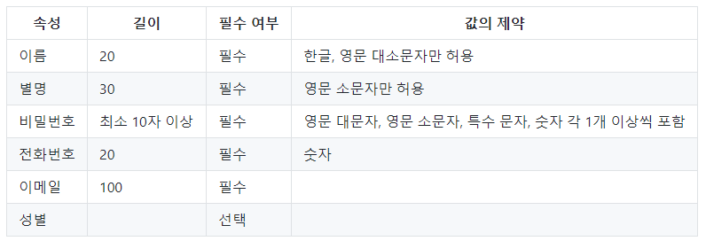  
   
## 회원 데이터 생성(회원가입) API
url : /user/register  
method : POST  
body : **name(이름)**, **nickname(별명)**, **phone(전화번호)**, **password(비밀번호)**, **email(이메일)**, gender(성별), recommendCode(추천인 코드)  
response : status(성공, 실패여부), message(응답 메세지)  

#### 요청 예시  
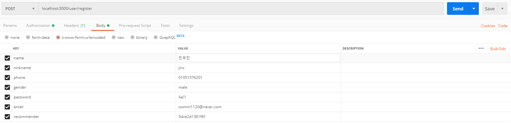

#### 응답 예시  
성공시  
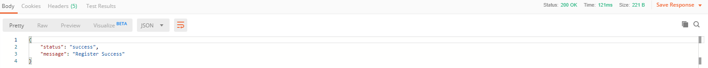  

실패시  
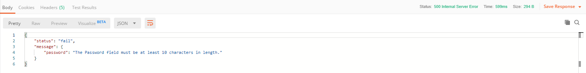  

## 회원 데이터 수정 API
url : /user/update/{id}  
method : PUT  
parameter : id(고유 인덱스)  
body : name(이름), nickname(별명), phone(전화번호), gender(성별)  
response : status(성공, 실패여부), message(응답 메세지)  

#### 요청 예시  
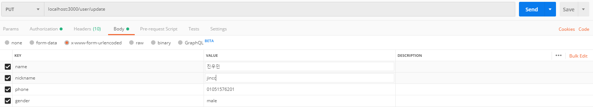

#### 응답 예시  
성공시  
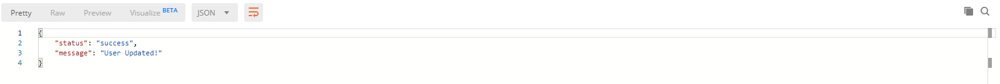  

실패시  
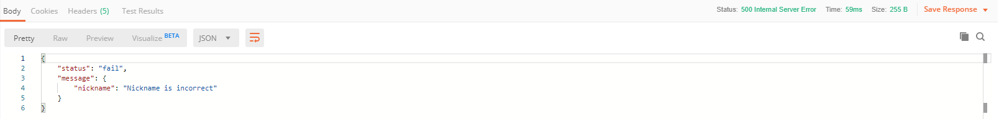  

## 회원 데이터 삭제 API
url : /user/delete/{id}  
method : DELETE  
parameter : id(고유 인덱스)  
response : status(성공, 실패여부), message(응답 메세지)  

#### 응답 예시  
성공시  
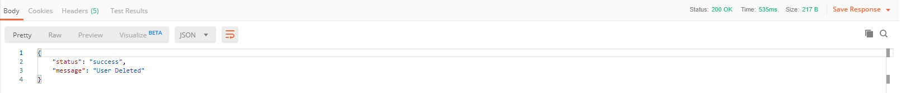  

실패시  
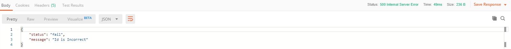  

## 하나의 회원 데이터 출력 API
url : /user/get/{id}  
method : GET  
parameter : id(고유 인덱스)  
response : status(성공, 실패여부), message(응답 메세지), **data(성공시에만 * 유저 데이터 반환)**    

#### 응답 예시  
성공시
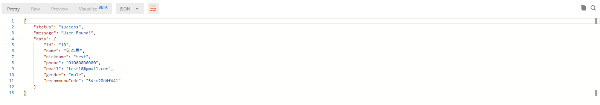  

실패시  
  

## 여러 회원 데이터 출력(페이지를 나눠 출력) API
url : /user/getList/{page}/{limit}  
method : GET  
parameter : page(페이지, 기본값 1), limit(한 페이지에 보여질 유저의 수, 기본값 10)  
response : status(성공, 실패여부), message(응답 메세지), **data(성공시에만 * 유저 데이터 반환)**

#### 응답 예시  
성공시  
* 요청  
  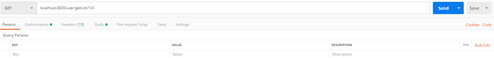
* 응답
  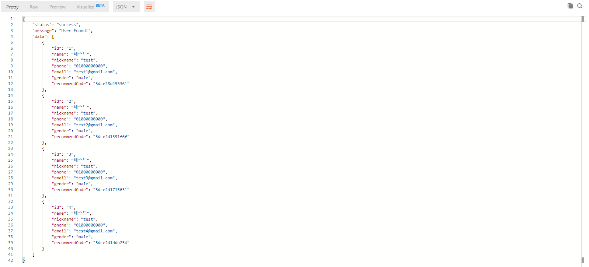

실패시  
* 요청  
  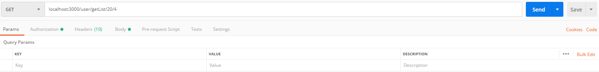
* 응답  
  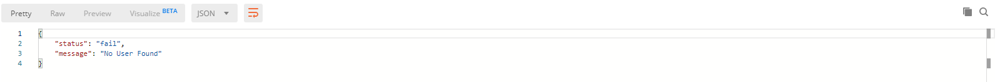